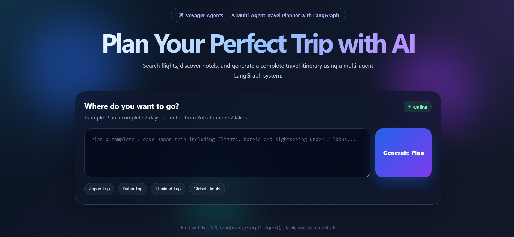
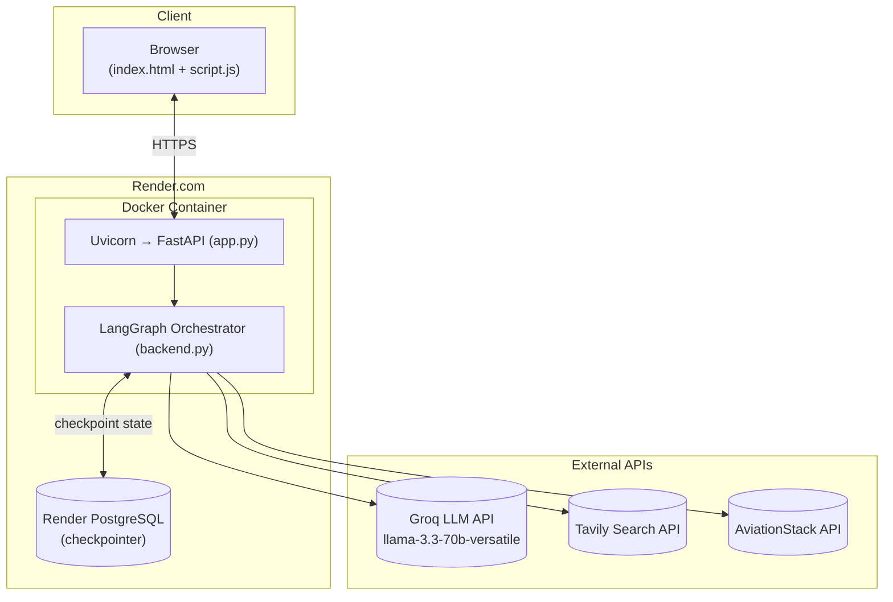
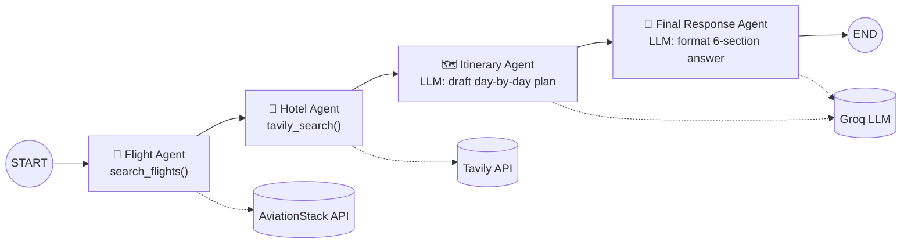

# ✈️ Voyager Agents

A multi-agent AI travel planner built with **LangGraph**, **FastAPI**, and **Groq**. Describe a trip in one sentence and a pipeline of four specialized agents finds real flights, real hotel options, and returns a complete, structured itinerary.


> 🔗 **Live Demo:** _add your Render URL here, e.g. `https://voyager-agents.onrender.com`_

---

## Table of Contents

- [Overview](#overview)
- [Features](#features)
- [Screenshots](#screenshots)
- [Architecture](#architecture)
- [Tech Stack](#tech-stack)
- [Project Structure](#project-structure)
- [Getting Started](#getting-started)
- [Running with Docker](#running-with-docker)
- [Deployment on Render](#deployment-on-render)
- [API Reference](#api-reference)
- [How It Works](#how-it-works)
- [Known Limitations](#known-limitations)
- [Roadmap](#roadmap)
- [Acknowledgements](#acknowledgements)

---

## Overview

Voyager Agents takes a natural-language travel request (e.g. *"Plan a complete 7 day Japan trip from Kolkata including flights, hotels and sightseeing under 2 lakhs"*) and routes it through a **LangGraph state graph** made up of four agents that each do one job — find flights, find hotels, draft an itinerary, and format the final answer. Conversation state is checkpointed in PostgreSQL so a planning session can be resumed by `thread_id`.

## Features

- 🛫 **Live flight lookups** via the AviationStack API, with automatic resolution of city/country names to IATA airport codes (e.g. "Japan" → `NRT`, "Dhaka" → `DAC`)
- 🏨 **Web-grounded hotel suggestions** via Tavily search
- 🧠 **LLM-drafted itinerary and final response**, generated by Groq's `llama-3.3-70b-versatile`
- 💾 **Persistent conversation state** per `thread_id`, backed by PostgreSQL (`langgraph-checkpoint-postgres`)
- 📄 **Markdown-rendered results** in the browser, with one-click **Copy** and **Download as PDF**
- ⚡ **Quick-prompt shortcuts** on the landing page (Japan / Dubai / Thailand / Global Flights)
- 🐳 **Dockerized** and deployed on **Render**

## Screenshots

> Add screenshots to `assets/screenshots/` and they'll render below. Suggested shots:

| Suggested file | What to capture |
|---|---|
| `assets/screenshots/homepage.png` | The landing page hero + input card in its idle state |
| `assets/screenshots/quick-prompts.png` | The quick-prompt buttons (Japan / Dubai / Thailand / Global Flights) |
| `assets/screenshots/loading-state.png` | The "Generate Plan" button mid-request, showing the loading spinner |
| `assets/screenshots/result-view.png` | A full rendered itinerary with the Copy / Download PDF actions visible |
| `assets/screenshots/pdf-export.png` | The exported PDF opened in a viewer |
| `assets/screenshots/mobile-view.png` | The responsive layout on a phone-sized viewport |
| `assets/screenshots/render-dashboard.png` | Your Render dashboard showing the deployed web service + PostgreSQL instance (nice proof-of-deployment shot for a portfolio) |

Example embed once added:

```markdown


```

## Architecture

### System Architecture



### Multi-Agent Pipeline

The core of the app is a LangGraph `StateGraph` that runs four agents **in sequence**, passing a shared `TravelState` object between them:



**State passed between agents (`TravelState`):**

| Field | Set by | Description |
|---|---|---|
| `user_query` | request | The raw natural-language travel request |
| `flight_results` | Flight Agent | Formatted live flight data (or an explanatory message if none found) |
| `hotel_results` | Hotel Agent | Web search results for hotels near the destination |
| `itinerary` | Itinerary Agent | The drafted day-by-day plan |
| `messages` | all agents | Running LangChain message history |
| `llm_calls` | all agents | Counter for how many LLM calls the request took |

Each agent function is a plain Python function registered as a graph node (`graph.add_node(...)`) and connected with `graph.add_edge(...)` — see [`backend.py`](backend.py).

## Tech Stack

| Layer | Technology |
|---|---|
| Orchestration | [LangGraph](https://github.com/langchain-ai/langgraph) (`StateGraph`, `PostgresSaver`) |
| LLM | [Groq](https://groq.com/) — `llama-3.3-70b-versatile` via `langchain-groq` |
| Flight data | [AviationStack API](https://aviationstack.com/) |
| Hotel/web search | [Tavily API](https://tavily.com/) |
| Backend framework | [FastAPI](https://fastapi.tiangolo.com/) + Uvicorn |
| Persistence | PostgreSQL (`psycopg`, `langgraph-checkpoint-postgres`) |
| Frontend | Jinja2 templates, vanilla JS, [marked.js](https://marked.js.org/) (Markdown rendering), [html2pdf.js](https://ekoopmans.github.io/html2pdf.js/) (PDF export) |
| Observability (optional) | [LangSmith](https://smith.langchain.com/) tracing |
| Containerization | Docker |
| Hosting | [Render](https://render.com/) |

## Project Structure

```
VoyagerAgents/
├── app.py                  # FastAPI app, routes (/, /api/travel, /health)
├── backend.py               # LangGraph state graph, agent nodes, Postgres checkpointer
├── requirements.txt          # Python dependencies
├── Dockerfile                # Container build definition
├── .dockerignore
├── .env                       # Local environment variables (not committed)
├── test.py                    # Quick manual CLI smoke test for the agent pipeline
├── tools/
│   ├── flight_tool.py          # AviationStack integration + IATA/city/country resolution
│   └── tavily_tool.py          # Tavily hotel/web search integration
├── templates/
│   └── index.html               # Main frontend page (Jinja2)
└── static/
    ├── style.css                 # Frontend styling
    └── script.js                  # Frontend logic (fetch, markdown render, PDF export)
```

## Getting Started

### Prerequisites

- Python 3.11+
- A PostgreSQL database (e.g. a free [Render PostgreSQL](https://render.com/docs/databases) instance)
- API keys for:
  - [Groq](https://console.groq.com/) — LLM inference
  - [AviationStack](https://aviationstack.com/) — flight data
  - [Tavily](https://tavily.com/) — web/hotel search

### Installation

```bash
git clone <your-repo-url>
cd VoyagerAgents

python -m venv venv
venv\Scripts\activate        # Windows
# source venv/bin/activate   # macOS/Linux

pip install -r requirements.txt
```

### Environment Variables

Create a `.env` file in the project root:

```env
DATABASE_URL=postgresql://<user>:<password>@<host>/<database>
GROQ_API_KEY=your_groq_api_key
AVIATIONSTACK_API_KEY=your_aviationstack_api_key
TAVILY_API_KEY=your_tavily_api_key
DEFAULT_ORIGIN_IATA=DEL

# Optional: LangSmith tracing
LANGSMITH_TRACING=true
LANGSMITH_ENDPOINT=https://api.smith.langchain.com
LANGSMITH_API_KEY=your_langsmith_api_key
LANGSMITH_PROJECT=VoyagerAgent
```

| Variable | Required | Description |
|---|---|---|
| `DATABASE_URL` | ✅ | PostgreSQL connection string used for LangGraph checkpointing. `sslmode=require` is appended automatically if missing. |
| `GROQ_API_KEY` | ✅ | Groq API key used by the Itinerary and Final Response agents |
| `AVIATIONSTACK_API_KEY` | ✅ | Powers the Flight Agent's live flight lookups |
| `TAVILY_API_KEY` | ✅ | Powers the Hotel Agent's web search |
| `DEFAULT_ORIGIN_IATA` | optional | Fallback departure airport (default `DEL`) used when a query only mentions a destination |
| `LANGSMITH_*` | optional | Enables LangSmith tracing/observability for the LangGraph run |

### Running Locally

```bash
python app.py
# or
uvicorn app:app --host 127.0.0.1 --port 8000 --reload
```

Then open **http://127.0.0.1:8000**.

You can also exercise the agent pipeline directly from the terminal without the web UI:

```bash
python test.py
```

## Running with Docker

```bash
docker build -t voyager-agents .
docker run --env-file .env -p 8000:8000 voyager-agents
```

The app will be available at **http://localhost:8000**.

## Deployment on Render

This project is deployed on [Render](https://render.com/) as a Docker-based Web Service:

1. Push the repository to GitHub (or your Git provider of choice).
2. In the Render dashboard, create a **New Web Service** and connect the repository.
3. Set the **Environment** to **Docker** — Render will automatically detect and build the `Dockerfile`.
4. Add all required environment variables (see the table above) under **Environment → Environment Variables**.
5. If you don't already have one, create a **Render PostgreSQL** instance and use its **External Database URL** as `DATABASE_URL`.
6. Deploy. Render builds the Docker image and runs:
   ```
   uvicorn app:app --host 0.0.0.0 --port 8000
   ```
7. Render assigns your service a public URL — visit it, plan a trip, and drop the URL into the **Live Demo** line at the top of this README.

> 💡 The `_conn = psycopg.connect(...)` call in `backend.py` runs at import time, and `checkpointer.setup()` creates the LangGraph checkpoint tables automatically on first boot — no manual migration step is needed.

## API Reference

### `GET /`
Renders the frontend (`templates/index.html`).

### `POST /api/travel`
Runs the full agent pipeline for a travel request.

**Request body:**
```json
{
  "message": "Plan a 5 day Dubai trip from Kolkata with flights, hotels and sightseeing.",
  "thread_id": null
}
```
`thread_id` is optional — omit it (or pass `null`) to start a new conversation thread; pass a previously returned `thread_id` to continue an existing one.

**Response body:**
```json
{
  "success": true,
  "thread_id": "user_3f9a...",
  "answer": "## Trip Summary\n...",
  "flight_results": "Live flights from CCU to DXB\n...",
  "hotel_results": "1. **Best Hotels in Dubai** ...",
  "itinerary": "Day 1: Arrival ...",
  "llm_calls": 2
}
```

### `GET /health`
Basic liveness check — returns `{"status": "ok", "message": "AI Travel Planner API is running"}`.

## How It Works

1. The user types a travel request into the textarea (or picks a quick-prompt) and clicks **Generate Plan**.
2. The frontend (`static/script.js`) `POST`s the message — and the current `thread_id`, if any — to `/api/travel`.
3. `app.py` calls `run_travel_agent(...)` in `backend.py`, which invokes the compiled LangGraph graph with a fresh or existing `thread_id`.
4. The graph runs the Flight → Hotel → Itinerary → Final Response agents in sequence, checkpointing state in PostgreSQL after each step.
5. The final formatted answer, along with the raw flight/hotel data and the resolved `thread_id`, is returned as JSON.
6. The frontend renders the Markdown answer, stores the `thread_id` in `localStorage` (so a returning user's next message continues the same thread), and offers **Copy** and **Download PDF** actions.

## Known Limitations

- AviationStack provides **live flight status**, not ticket prices — the app is upfront about this in its responses. A fare-pricing API (e.g. Amadeus) would be needed for real prices.
- Flights and hotels are resolved from natural-language text using rule-based parsing (`tools/flight_tool.py`); unusual phrasing may not resolve to the correct airport.
- The pipeline runs agents strictly in sequence — there's no dynamic re-planning if, say, no flights are found for a route.

## Roadmap

- Real fare pricing integration
- Multi-city / round-trip itineraries
- Streaming the itinerary/final answer to the frontend as it's generated
- User accounts so trip threads persist beyond a single browser's `localStorage`

## Acknowledgements

- [LangGraph](https://github.com/langchain-ai/langgraph) / [LangChain](https://www.langchain.com/) for the agent orchestration framework
- [Groq](https://groq.com/) for fast LLM inference
- [Tavily](https://tavily.com/) for web search
- [AviationStack](https://aviationstack.com/) for flight data
- [marked.js](https://marked.js.org/) and [html2pdf.js](https://ekoopmans.github.io/html2pdf.js/) for frontend rendering/export
- [Render](https://render.com/) for hosting

---

See [`PROJECT_DESCRIPTION.md`](PROJECT_DESCRIPTION.md) for a higher-level description of the problem this project solves and its design motivations.
